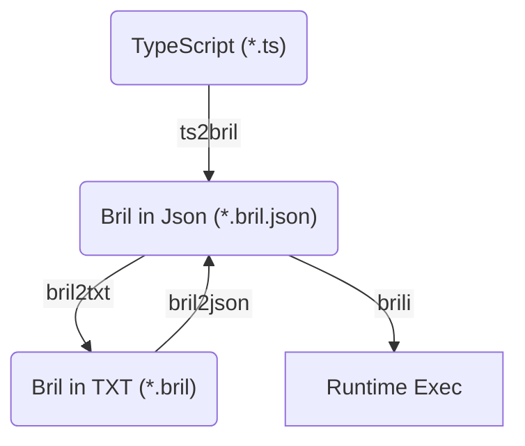

# Part 1: Benchmark and run in Bril

## Prerequisite

Before running any make rules, ensure the required tools are available in the environment. Please check the [repo Readme](https://github.com/jiangqucheng/EECE7398_ST_Compiler/blob/main/README.md) which is located in the root directory of this repo for instructions on setting up the environment. Once the environment is set up, you can use the following command to run a check of the required tools:

```bash
make check-tools
```

## Workflow

Benchmarks in this HW are written in Typescript. The path to generate all kinds of stuff are showing in the following graph. 




## Workflow: Generate bril code in json/txt format

To generate bril code in json/txt format, you can use the following two commands.

```bash
make benchmark/<TARGET>.bril.json  # bril in json format
make benchmark/<TARGET>.bril       # bril in txt format
# TARGET can be `euler`, `fibonacci`
```

## Workflow: Run tests

By following these steps and using the Makefile, you can easily generate bril code in json/txt format and run tests to validate the generated code.

```bash
make run          # run all benchmarks
make run_<TARGET> # run specified benchmark: <TARGET>
make turnt        # benchmark check using turnt 
make              # default: run all + turnt check
```

## Benchmark: `euler`

This TypeScript code (`benchmark/euler.ts`) defines three functions: `app_main`, `factorial`, and `taylor_series_euler`. These functions work together to compute an approximation of Euler's number (e) using the Taylor series expansion.

The `app_main` function serves as the entry point of the program. It takes a single argument `n`, which determines the number of terms to include in the Taylor series approximation. Inside this function, the `taylor_series_euler` function is called with `n` as its argument, and the result is stored in the variable `e`. Finally, the value of `e` is printed to the console.

The `factorial` function is a recursive function that calculates the factorial of a given number `n`. The factorial of a number is the product of all positive integers up to that number. The base case for the recursion is when `n` is less than or equal to 1, in which case the function returns 1. For other values of `n`, the function calls itself with `n-1` and multiplies the result by `n`.

The `taylor_series_euler` function computes the approximation of Euler's number using the Taylor series expansion. It initializes a variable `e` to `0` and iterates from `0` to `n-1`. In each iteration, it adds the reciprocal of the factorial of the current index `i` to `e`. This process accumulates the sum of the series terms, which approximates Euler's number. After the loop completes, the function returns the computed value of `e`.

Finally, the `app_main` function is called with the argument 10, which means the program will compute the approximation of Euler's number using the first 10 terms of the Taylor series and print the result to the console.

## Benchmark: `fibonacci`

This TypeScript code (`benchmark/fibonacci.ts`) defines two functions: `fibonacci` and `printFibonacciSeries`. These functions work together to calculate and print the Fibonacci sequence up to a specified number of terms.

The `fibonacci` function calculates the Fibonacci number at a given position `n`. The Fibonacci sequence is a series of numbers where each number is the sum of the two preceding ones, usually starting with 0 and 1. The function uses a recursive approach to compute the Fibonacci number. If `n` is less than or equal to 1, the function returns `n` directly, as the first two numbers in the Fibonacci sequence are 0 and 1. For other values of `n`, the function calls itself with `n-1` and `n-2` and returns the sum of these two calls. This recursive approach effectively builds the Fibonacci sequence by breaking down the problem into smaller subproblems.

The `printFibonacciSeries` function prints the Fibonacci series up to a given count. It takes a single parameter `count`, which specifies the number of Fibonacci numbers to print. The function uses a `for` loop to iterate from 0 to `count-1`. In each iteration, it calls the `fibonacci` function to compute the Fibonacci number at the current index `i` and stores the result in the variable `fib`. It then prints the index `i` and the corresponding Fibonacci number `fib` to the console. This function provides a way to visualize the Fibonacci sequence by printing each term along with its position in the sequence.

Finally, the `printFibonacciSeries` function is called with the argument 10, which means the program will print the first 10 numbers in the Fibonacci sequence. This call demonstrates the functionality of both the `fibonacci` and `printFibonacciSeries` functions, showing how they work together to compute and display the Fibonacci sequence.


## `turnt` Verification

`turnt` is a simple snapshot testing tool inspired by Cram and LLVM's lit. It is useful for testing programs that translate text files to other text files, such as compilers. The idea behind Turnt is that each test is represented by an input file, and the tool runs a command to generate an output file. The output file is then compared against a saved "golden" output file to check for any differences.

To use Turnt in my workflow, I have follow these steps:

1. Configure: Create a `turnt.toml` configuration file and specify the command to test. The command include `{filename}` as a placeholder for the input file.

2. Create a test: Write an input file next to the `turnt.toml` file. This input file represents a specific test case.

3. Take a snapshot: Run `turnt --save <input_file>` to execute the specified command with the input file and save the standard output into an output file. Review the output file to ensure it matches the expectations. Both the input and output files are checked into version control.

4. Test the work: Use `turnt <input_file>` to run all the tests and confirm that the output still matches the saved output files. 

For implementation details, you can check the `makefile` and `turnt.toml` in current folder. The `makefile` contains targets for running the tests using Turnt, while the `turnt.toml` file specifies the command to be tested and any additional configuration options.


# Homework Compliance Check Requirement

## Test methods, inputs, and quantitative results

### Testing Methods and Inputs
To ensure the correctness of the benchmarks, I conducted several rounds of testing:

**Unit Testing**: I verified the individual TypeScript functions before converting them into Bril. This was done by executing the TypeScript code and comparing the results with expected outputs.

**Integration Testing**: After converting the TypeScript functions into Bril, I ran the Bril benchmarks using `brili` to ensure they executed correctly and produced expected outputs. For example, the `fibonacci` benchmark was tested with various input values, and the output sequence was compared with the known Fibonacci sequence that is documented on the internet.

**Regression Testing**: I used `turnt` to create saved test outputs for each benchmark. This allowed me to run the benchmarks multiple times and verify that the outputs remained consistent across runs.

```bash
turnt -e ts2bril-brili --save benchmark/euler.bril
turnt -e ts2bril-brili --save benchmark/fibonacci.bril
```

### Quantitative Results
For each benchmark, I recorded the profile output from `brili` while running each benchmark. The results are summarized below:

**Euler Benchmark**:
```log
<!-- STDOUT from program -->
2.71828152557319225
<!-- output from brili profiler -->
total_dyn_inst: 635
```

**Fibonacci Benchmark**:
```log
<!-- STDOUT from program -->
0.00000000000000000 0.00000000000000000
1.00000000000000000 1.00000000000000000
2.00000000000000000 1.00000000000000000
3.00000000000000000 2.00000000000000000
4.00000000000000000 3.00000000000000000
5.00000000000000000 5.00000000000000000
6.00000000000000000 8.00000000000000000
7.00000000000000000 13.00000000000000000
8.00000000000000000 21.00000000000000000
9.00000000000000000 34.00000000000000000
<!-- output from brili profiler -->
total_dyn_inst: 2889
```

### Full test log
```bash
❯ cd EECE7398_ST_Compiler/HW1/Part1
❯ make
Checking for deno: Found
Checking for bril2json: Found
Checking for bril2txt: Found
Checking for brili: Found
Checking for ts2bril: Found
All tools are available!
🎯 Generate [benchmark/euler.ts] -> [benchmark/euler.bril.json]
ts2bril benchmark/euler.ts > benchmark/euler.bril.json
🧐 Running test on [benchmark/euler.bril.json]
brili -p < benchmark/euler.bril.json
2.71828152557319225
total_dyn_inst: 635
🎯 Generate [benchmark/fibonacci.ts] -> [benchmark/fibonacci.bril.json]
ts2bril benchmark/fibonacci.ts > benchmark/fibonacci.bril.json
🧐 Running test on [benchmark/fibonacci.bril.json]
brili -p < benchmark/fibonacci.bril.json
0.00000000000000000 0.00000000000000000
1.00000000000000000 1.00000000000000000
2.00000000000000000 1.00000000000000000
3.00000000000000000 2.00000000000000000
4.00000000000000000 3.00000000000000000
5.00000000000000000 5.00000000000000000
6.00000000000000000 8.00000000000000000
7.00000000000000000 13.00000000000000000
8.00000000000000000 21.00000000000000000
9.00000000000000000 34.00000000000000000
total_dyn_inst: 2889
🧐 Running tests on all benchmarks...
🧪 Running turnt tests...
1..1
ok 1 - benchmark/euler.ts ts2bril-brili
1..1
ok 1 - benchmark/fibonacci.ts ts2bril-brili
Current directory: /scratch/work/course/EECE7398_ST_Compiler/HW1/Part1
rm benchmark/euler.bril.json benchmark/fibonacci.bril.json
```

## Challenges
The main challenge was configuring the toolchain and ensuring compatibility with the Bril interpreter. I encountered issues with tool dependencies and resolved them by carefully setting up the environment, as detailed in the `README.md`.