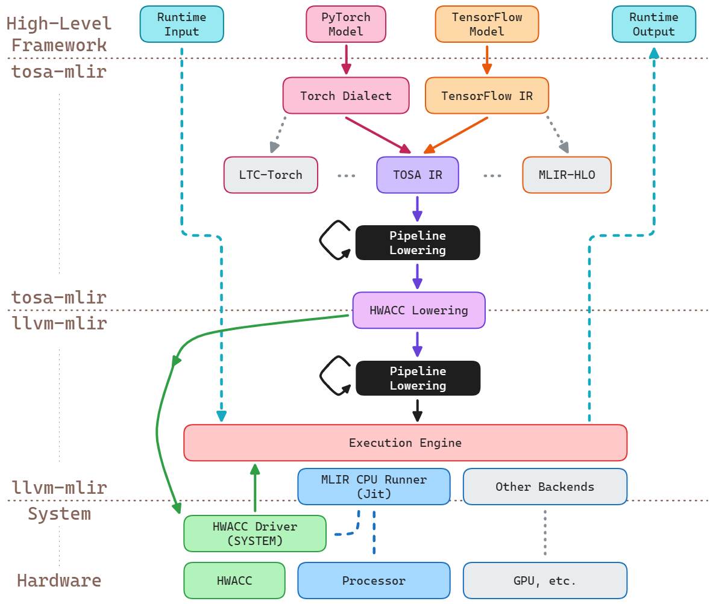

## Project Topic
Implementing a Customized HWACC Lowering Channel for MLIR with Multi-Backend Support and Task Coordination

## Goal
The primary goal of this project is to implement a customized lowering channel within the MLIR framework to adapt a hardware GEMM accelerator (HWACC) design. The project will focus on optimizing the execution of matrix operations through the MLIR infrastructure, leveraging the HWACC backend. Additionally, the project will explore the potential for integrating multiple backends and implementing a coordinator for dynamic task organization and execution across various hardware targets.

## Design
The design consists of the following components.

### Customized HWACC Lowering Channel
The main task will be to implement the lowering process to integrate the HWACC design within MLIR, ensuring efficient execution of matrix operations like GEMM.
### Multi-Backend Support (integrate with existing backends)
Extend the existing infrastructure to allow interoperability with multiple hardware backends, such as GPUs, FPGAs, or custom ASICs, by adding support for dynamic backend selection.
### Task Coordination
Develop a lightweight coordinator that can dynamically allocate tasks across supported backends based on runtime performance metrics and workload requirements.
### Integration with MLIR’s Existing Infrastructure
Use MLIR’s existing dialects, conversion, and optimization passes to implement the lowering sequence while making the necessary adaptations for the HWACC.

## Implementation Outline

### Implement Customized HWACC Lowering Channel
Develop custom MLIR passes to lower high-level matrix operations into the HWACC-specific instructions.
Ensure compatibility with the LLVM backend to generate the final machine code for the HWACC.
### Extend Support for Multi-Backend Execution:
Create dialects and conversion mechanisms to support multiple hardware backends. (?)
Implement hooks for dynamic selection of backends based on workload and hardware characteristics.
### Task Coordinator Development
Design a lightweight coordinator module to schedule tasks among the supported backends.
Develop policies for load balancing and resource management to optimize the execution flow.
### Testing and Evaluation
Set up benchmarks (e.g., GEMM) to evaluate the performance improvements with HWACC.
Compare results with traditional implementations using static backend assignment to assess the effectiveness of dynamic task allocation.

## Potential Hard Parts
Efficient Lowering and Optimization: Developing an optimal lowering channel for HWACC while keeping the codebase maintainable will require careful planning.
Dynamic Task Coordination Overhead: Implementing a task coordinator that provides significant performance benefits without adding too much overhead could be challenging.
